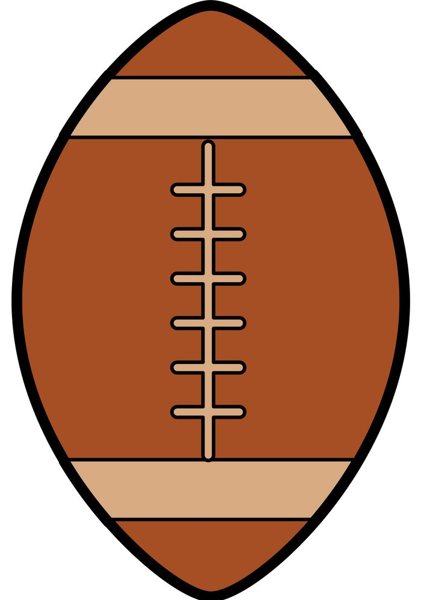
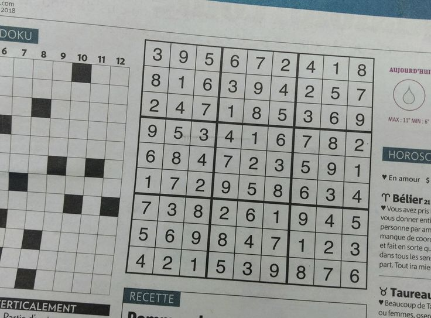

# 🤖 Ảnh gốc để dùng.

  <h2>Thư mục tổng hợp một số ảnh gốc</h2>
  
<em></em>

<table>
  <tr>
    <th>[Ảnh bóng bầu dục](https://github.com/MyDreamIsHere0511/ComputerVision/blob/main/images/ball1.jpg)</th>
    <th>Ảnh Sudoku</th>
  </tr>
  <tr>
    <td></td>
    <td></td>
  </tr>
</table>
